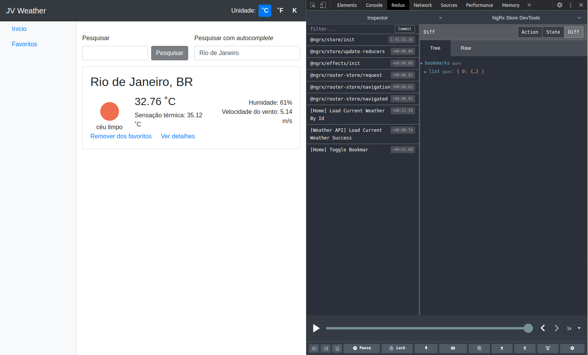

# Jv Weather

<p align="center">
  

  
  
  <a href="https://github.com/vitorsemidio-dev/dio-weather-ngrx/commits/master">
    
  </a>
    
   
</p>

Projeto desenvolvido durante um dos cursos da [Digital Innovation One](https://digitalinnovation.one/). Este projeto permite previsão do tempo de diversas cidades, com a possibilidade de adicionar/remover cidades aos favoritos, ver o clima da semana.

Repositório original: [João Ghignatti](https://github.com/JGhignatti/jv-weather)

## 📸 Imagem do projeto



## 🔥 Como rodar o projeto?

Clone o repositório

```
$ git clone https://github.com/vitorsemidio-dev/dio-weather-ngrx
```

Instale as dependências

```
$ npm install
```

Inicie o projeto Angular

```
$ npm run start
```

## 🚀 Tecnologias usadas

- [Angular](https://angular.io/)
- [Open Weather](https://openweathermap.org/)
- [NgRx](https://ngrx.io/)
